# TAREA 6 - JAVASCRIPT

## Ejercicio 1

Escribir un programa que solicite al usuario que ingrese su nombre. El nombre se debe almacenar en una variable llamada nombre. A continuacion se debe mostrar en pantalla el texto "Ahora estas en la matrix[usuario]", donde [usuario] se reemplazará por el nombre que el usuario haya ingresado.

```javascript 
var nombre = prompt ("Ingrese su nombre");
console.log("Ahora estas en la matrix "+ nombre);
```

### EVIDENCIA 
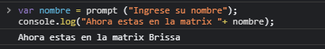

## EJERCICIO 2

Escribir un programa que solicite al usuario ingresar un numero con decimales y almacénalo en una variable. A continuación, el programa debe solicitar al usuario que ingrese un numero entero y guardarlo en otra variable. En tercera variable se deberá guardar el resultado de la suma de los dos números ingresados por el usuario. Por último, se debe mostrar en pantalla el texto "El resultado de la suma es [suma]", donde suma se reemplazará por el resultado de la operación.

```javascript 
var num1 = parseFloat(prompt("Ingrese un numero con decimales"));
var num2 = parseInt(prompt("Ingrese un numero entero"));
var suma= num1+num2;
console.log("El resultado de la suma es: "+ suma);
```

### EVIDENCIA 
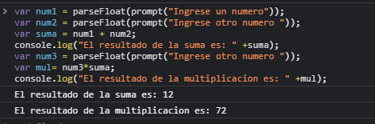

## EJERCICIO 3

Escribir un programa que solicite al usuario dos números y los almacene en dos variables. En otra variable, almacena el resultado de la suma de esos dos números y luego mostrar ese resultado en pantalla. A continuación, el programa debe solicitar al usuario un tercer número, el cual debe almacenar en una nueva variable. Por último, mostrar en la pantalla el resultado de la multiplicación de este nuevo número por el resultado de la suma anterior.

```javascript 
var num1 = parseFloat(prompt("Ingrese un numero"));
var num2 = parseFloat(prompt("Ingrese otro numero "));
var suma = num1 + num2;
console.log("El resultado de la suma es: "+ tostring(suma));
var num3 = parseFloat(prompt("Ingrese otro numero "));
var mul= num3*suma;
console.log("El resultado de la multiplicacion es: "+ tostring(mul));
```

### EVIDENCIA 


## EJERCICIO 4

Escribir un programa que solicite al usuario ingresar la cantidad de kilómetros recorridos por una motocicleta y la cantidad de litros de combustible que consumió durante ese recorrido. Mostrar el consumo de combustible por kilometro.

```javascript 
var km = parseFloat(prompt("Ingrese el kilometraje recorrido"));
var comb = parseFloat(prompt("Ingrese la cantidad de litros de combustible gastado "));
var con= comb/km;
console.log("El combustible consumido por kilometros es igual a : " + con + " litros");
```

### EVIDENCIA 
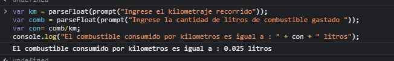

## EJERCICIO 5 

Escribir un programa que solicite al usuario el ingreso de una temperatura en escala Fahrenheit (debe permitir decimales) y le muestre el equivalente en grados Celsius. La fórmula de conversión que se usa para este cálculo es: Celsius=(5/9)*(Fahrenheit-32).

```javascript 
var fahrenheit = parseFloat(prompt("Ingrese una temperatura en fahrenheit"));
var celsius=(5/9) * (fahrenheit-32);
console.log("La temperatura en celsius es : " + celsius);
```

### EVIDENCIA 
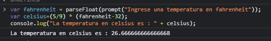


## EJERCICIO 6

Escribir un programa que solicite al usuario ingresar tres números para luego mostrarle el promedio de los tres.

```javascript 
var num1 = parseFloat(prompt("Ingrese un numero"));
var num2 = parseFloat(prompt("Ingrese otro numero "));
var num3 = parseFloat(prompt("Ingrese otro numero "));
var pro= (num1+num2+num3)/3;
console.log("El promedio es : " + pro);
```

### EVIDENCIA
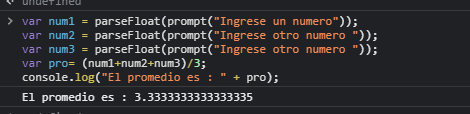

## EJERCICIO 7

Escribir un programa que solicite al usuario un número y le reste el 15%, almacenando todo en una única variable. A continuación, mostrar el resultado final en pantalla

```javascript 
var num1= parseFloat(prompt("Ingrese un numero" ));
num1= num1-(num1*0.15);
console.log("Con el descuento queda en:  " + num1);
```

### EVIDENCIA
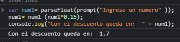

## EJERCICIO 8

Escribir un programa que solicite al usuario el ingreso de dos palabras, las cuales se guardaran en dos variables distintas. A continuación, almacena en una variable la concatenación de la primera palabra, más un espacio, más la segunda palabra. Mostrar este resultado en pantalla.

```javascript 
var pal1= prompt("Ingrese la primera palabra");
var pal2= prompt("Ingrese la segunda palabra ");
pal1 +" "+pal2;
```

### EVIDENCIA
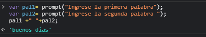

## EJERCICIO 9

Escribir un programa que solicite al usuario el ingreso de un texto y almacene ese texto en una variable. A continuación, mostrar en pantalla la primera letra del texto ingresado. Luego solicitar al usuario que ingrese un número positivo menor a la cantidad de caracteres que tiene el texto que ingreso, y almacenar este número en una variable llamada índice. Mostrar en pantalla el carácter del texto ubicado en la posición dada por índice.

```javascript 
 var text= prompt("Ingrese un texto");
 console.log(text.charAt());
 var indice= prompt("Ingrese un numero que no supere la cantidad de caracteres");
 console.log(text.charAt(indice));
```

### EVIDENCIA
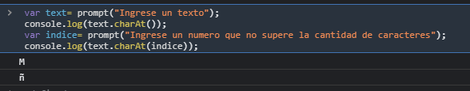

## EJERCICIO 10

Escribir un programa que solicite al usuario que ingrese cuantos shows musicales ha visto en el último año y almacene ese número en una variable. A continuación, mostrar en pantalla un valor de verdad (True o False) que indique si el usuario ha visto más de 3 shows.

```javascript 
var cant= parseInt(prompt("¿Cuantos shows musicales ha visto el ultimo año ?"));
cant >3;
```

### EVIDENCIA
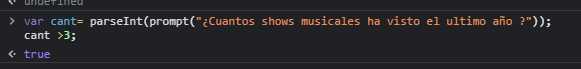

## EJERCICIO 11

Escribir un programa que le solicite al usuario ingresar una fecha formulada por 8 números, donde los primeros dos representan el día, los siguientes dos el mes y los últimos cuatro el año. Este dato debe guardarse en una variable con tipo int. Finalmente, mostrar al usuario la fecha con el formato DD/MM/AAAA.

```javascript 
var fecha= prompt("Ingrese por favor una fecha de esta manera : DDMMAAAA");
fecha.charAt(0)+fecha.charAt(1)+"/"+ fecha.charAt(2)+fecha.charAt(3)+"/"+ fecha.charAt(4)+ fecha.charAt(5)+ fecha.charAt(6)+ fecha.charAt(7);
```

### EVIDENCIA
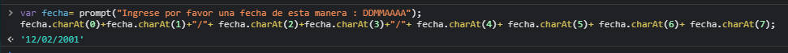

## EJERCICIO 12

Escribir un programa para solicitar al usuario el ingreso de un número Entero y que luego imprima un valor de verdad dependiendo de si el número es par o no. recordar que un número es par si el resto, al dividirlo por 2, es 0.

```javascript 
 var num1= parseInt(prompt("Ingrese un numero"));
 var par = num1 % 2;
 par == 0;
```

### EVIDENCIA
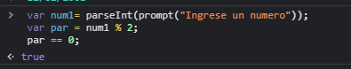

## EJERCICIO 13

Escribir un programa que le solicite al usuario su edad y la guarde en una variable. Que luego solicite la cantidad de artículos comprados en una tienda y lo guarde en otra variable. Finalmente, mostrar en pantalla un valor de verdad que indique si el usuario es mayor de 18 años y además compro más de 1 articulo.

```javascript 
var edad = parseInt(prompt("Ingrese su edad "));
var art =parseInt(prompt("Ingrese la cantidad de articulos que ha comprado"));
edad > 18 && art > 1;
```

### EVIDENCIA
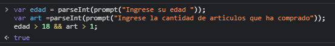

## EJERCICIO 14

Escribir un programa que, da una cadena de texto, imprima true si la cantidad de caracteres en la cadena es un número impar, o false si no lo es.

```javascript 
var text= prompt("Ingrese un texto");
if (text.length % 2 == 0) {
  console.log("False");
}
else {
  console.log("True");
}
```

### EVIDENCIA
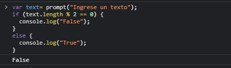

## EJERCICIO 15

Escribir un programa que le pida al usuario ingresar dos palabras y las guarde en dos variables, y que luego imprima True si la primera palabra es menor que la segunda o false si no lo es.

```javascript 
var pal1= prompt("Ingrese la palabra 1");
 var pal2= prompt("Ingrese la palabra 2");
 if (pal1.length<pal2.length){
      console.log("True");
 }
 else {
  console.log("False");
 }
```

### EVIDENCIA
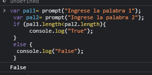

## EJERCICIO 16

Escribir un programa para pedir al usuario su nombre y luego el nombre de otra persona, almacenando cada nombre en una variable. Luego mostrar en pantalla un valor de verdad que indique si: los nombres de ambas personas comienzan con la misma letra o si terminan con la misma letra.

```javascript 
var nom1= prompt("Ingres su nombre");
var nom2= prompt("Ingrese el nombre de otra persona");
(nom1.charAt()==nom2.charAt() || nom1.charAt(nom1.length-1)==nom2.charAt(nom2.length-1));
```

### EVIDENCIA
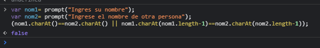

## EJERCICIO 17

Escribir un programa que, dado un número entero, muestre su valor absoluto. Recordar que , para los números positivos su valor absoluto es igual al número, mientras que, para los negativos, su valor absoluto es el número multiplicado por -1.

```javascript 
var num= prompt("Ingrese un numero entero");
 Math.abs (num);
```
```javascript 
 var num= prompt("Ingrese un numero entero")
 if (num>0){
   num= num
 }
 else{
   (num *(-1))
 }
```

### EVIDENCIA
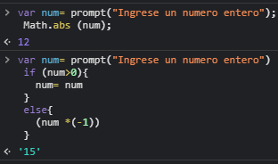

## EJERCICIO 18

Escribir un programa que solicite al usuario ingresar dos números diferentes y muestre en pantalla al mayor de los dos.

```javascript 
var num1= prompt("Ingrese un numero");
var num2= prompt("Ingrese otro numero");
Math.max (num1, num2);
```
```javascript 
var num1= prompt("Ingrese un numero")
var num2= prompt("Ingrese otro numero")

if(num1<num2){
  num1
}
else{
  num2
}
```

### EVIDENCIA
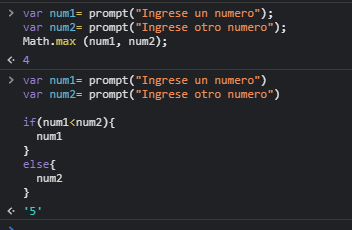

## EJERCICIO 19

Escribir un programa que solicite al usuario una letra y, si es una vocal, muestre el mensaje "Es vocal". Verificar si el usuario ingreso un string de más de un carácter y, en ese caso, informarle que no se puede procesar el dato.

```javascript 
var voc= prompt("Ingrese una letra");
if (voc.length>1){
    console.log("No se puede procesar el dato ya que tiene mas de 1 caracter")
}
 else if (voc=="a"|| voc=="e" || voc=="i" || voc=="o" || voc=="u"){
    console.log("Es vocal");  
  }
  else {
    console.log("No es vocal")
  }
```

### EVIDENCIA
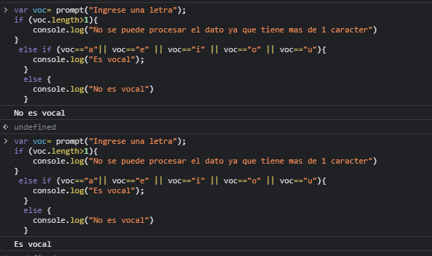

## EJERCICIO 20

Escribir un programa para solicitar al usuario tres números y mostrar al menor de los tres.

```javascript 
var num1= parseFloat(prompt("Ingrese un numero"));
var num2= parseFloat(prompt("Ingrese otro numero"));
var num3=parseFloat(prompt("Ingrese otro numero"));
Math.min (num1, num2, num3)
```

### EVIDENCIA
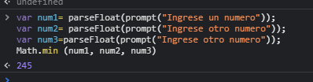
